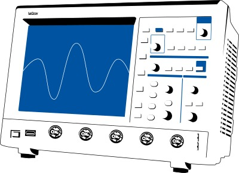

WaveJet Control connects to a LeCroy WaveJet oscilloscope over the network and
allows to remotely change its settings and view the traces. It offers a GTK+
interface and talks GPIB. It acts as an alternative to sitting behind the
oscilloscope itself, which you can't expect to do very often with a remote
oscilloscope such as this one.

# Requirements

  - GTK+ 2.2.4 or later (with the development libs)
  - libpng 1.2 or later (with the development libs)

# Build & Installation

 1. make
 1. make install

# Installation Tuning

The installation prefix is set to `/usr/local` by default. This may by
changed by setting/changing the `PREFIX` environment variable before
running `make`:

tcsh:

```
setenv PREFIX /alternative/installation/prefix
```

bash:

```
export PREFIX=/alternative/installation/prefix
```

Note that the executable is stripped before it's installed (but not
after it's compiled).

# Uninstallation

```
make uninstall
```

If you used an alternate `PREFIX`, make sure the environment variable is
set accordingly.
